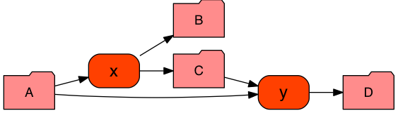

# Spate quickstart

**Spate** is a lightweight library to create file-based data processing workflows (or *dataflows*), regardless of the software (and hardware) environment that will execute this workflow. Because of this decoupling you can design a workflow without worrying about where to run it, and focus on its logic instead. Since **Spate** is a Python library, you can use complex Python logic to build your workflow the way you want.

With **Spate** you declare your jobs as accepting input *paths* (i.e., files or directories) and/or producing output paths. **Spate** will automatically identify the jobs that need to be executed based on the existence of these paths, and their modification time. For example, a job accepting an input file ``A`` and producing an output file ``B`` will be flagged for execution either if ``B`` is missing, or if ``A`` is more recent than ``B``.

**Spate** can manage job dependencies regardless of the size or complexity of your workflow. If a job flagged for execution produces files that are used by other jobs, these jobs will also be flagged for execution.

Finally, **Spate** knows how to run your workflow on various software platforms, including a plain shell script, existing workflow systems such as [Makeflow](http://ccl.cse.nd.edu/software/makeflow/), [Drake](https://github.com/Factual/drake), or job schedulers such as [TORQUE/PBS](http://www.adaptivecomputing.com/products/open-source/torque/) and [SLURM](http://slurm.schedmd.com/). You only need to call a simple function to export an existing **Spate** workflow to any of these platforms; **Spate** will deal with the messy details for you.

## Installation

**Spate** is a standard, pure Python library which can be downloaded from its dedicated Github [repository]() and installed with `pip`:

``` shell
$ wget <path_to_github_release>
$ pip install <path_to_package>
```

Note that **Spate** also installs some mandatory dependencies automatically. Optionally the [pygraphviz](https://pygraphviz.github.io/) library can be installed to enable the drawing of workflows with [Graphviz](http://www.graphviz.org/); see example below.

## Usage

### Example 1. Basic abstract workflow

**Spate** is meant to be used by other Python scripts, and once installed can be imported by typing `import spate`. Here is an example script `example_1.py` creating a toy workflow:

```python
import spate

# create a new workflow
workflow = spate.new_workflow("example-1")

# add some jobs
workflow.add_job("A", ("B", "C"), name = "x")  # A-[x]->B,C
workflow.add_job(("A", "C"), "D", name = "y")  # A,C-[y]->D

# print some basic information about this workflow
print "number of jobs:", workflow.number_of_jobs
print "number of paths:", workflow.number_of_paths

# print the jobs in this workflow,
# in the order of their execution
spate.echo(workflow, colorized = True)

# create a diagram of this workflow;
# note that this requires the optional
# 'pygraphviz' package to be installed
spate.draw(workflow, "example_1.png")

# save this workflow for later (re)use
spate.save(workflow, "example_1.spate.gz")
```

Running this script will create the workflow, save it as a file for later use, and display the jobs that will be executed (in the right order) if the workflow was to be run:

```shell
$ python example_1.py
number of jobs: 2
number of paths: 4
< A
x
> B
> C

< A
< C
y
> D

total: 2 outdated jobs (out of 2)
```

Here the `spate.echo()` function generated a simple list of job identifiers preceded by input paths (lines prefixed with `<`) and followed by output paths (lines prefixed with `>`). If this workflow was to be executed, job `x` would be run before job `y`.



Here the `spate.draw()` function generated a diagram of the workflow showing both the jobs (rounded rectangles) and paths (folder-shaped nodes) and their status; red paths are missing, and red jobs are outdated.

### Example 2. Basic concrete workflow

In the previous example our jobs did not have any code attached; as such, our workflow was purely abstract. To attach a piece of code to a job you can use the `content` argument of the `add_job()` function. This argument accepts a string with your code. For example, given the following script `example_2.py`:

```python
import spate

# create a new workflow
workflow = spate.new_workflow("example-2")

# add some jobs, with Unix shell-compatible code
workflow.add_job(
    inputs = "A",
    outputs = ("B", "C"),
    name = "x",
    content = """
        grep my_pattern A > B
        grep -v my_pattern A > C
        """)

workflow.add_job(
    inputs = ("A", "C"),
    outputs = "D",
    name = "y",
    content = "cat A C > D")

# export this workflow as a shell script (BASH by default)
spate.to_shell_script(workflow, "example_2.sh")
```

Upon execution this script will generate an executable BASH shell script (other shells can be used as well) that is ready to run:

```shell
$ python ./example_2.py

$ ls
example_2.py example_2.sh

$ less example_2.sh
#/bin/bash

# x
grep my_pattern A > B
grep -v my_pattern A > C

# y
cat A C > D
```

### Example 3. Advanced concrete workflow

You may have noticed that the content for both jobs `x` and `y` in our previous example had the name of the input and output paths hardcoded. This is inconvenient if you want to write generic code (i.e., code that would work regardless of the name of the input and/or output paths). To solve this problem **Spate** allow the use of *template engines*.

A template engine will look for specific tags in your job code and replace them by the content of some variables. By default, all jobs have the following variables accessible to their code:

name | content
--- | ---
`INPUTS` | List of input paths
`INPUTN` | Number of input paths
`INPUT` | First input path
`INPUTn` | Input path in position *n*, starting from zero
`OUTPUTS` | List of output paths
`OUTPUTN` | Number of output paths
`OUTPUT` | First output path
`OUTPUTn` | Output path in position *n*, starting from zero

The tags you will use in your job code are dependent of the template engine you chose. **Spate** comes with two engines: a very simple one using the `string.Template` class (see [here](https://docs.python.org/2/library/string.html#template-strings) for a documentation of its syntax), and a more comprehensive one using the Mustache syntax (see [here](http://mustache.github.io/) for the documentation). By default **Spate** uses the Mustache engine.

Setting a template engine for your workflow is as simple as calling the `spate.set_template_engine()` function. Here are two examples (one for each template engine), `example_3a.py` and `example_3b.py`:

```python
import spate

# use the simple Python 'string' engine
spate.set_template_engine(spate.string_template_engine)

workflow = spate.new_workflow("example-3a")

# declare jobs using a compatible template
workflow.add_job(
    inputs = "A",
    outputs = ("B", "C"),
    name = "x",
    content = """
        grep my_pattern $INPUT > $OUTPUT0
        grep -v my_pattern $INPUT > $OUTPUT1
        """)

workflow.add_job(
    inputs = ("A", "C"),
    outputs = "D",
    name = "y",
    content = "cat $INPUT0 $INPUT1 > $OUTPUT")

# export this workflow as a shell script
spate.to_shell_script(workflow, "example_3a.sh")
```

```python
import spate

# use the Mustache template engine
spate.set_template_engine(spate.mustache_template_engine)

workflow = spate.new_workflow("example-3b")

# declare jobs using a compatible template
workflow.add_job(
    inputs = "A",
    outputs = ("B", "C"),
    name = "x",
    content = """
        grep my_pattern {{INPUT}} > {{OUTPUT0}}
        grep -v my_pattern {{INPUT}} > {{OUTPUT1}}
        """)

workflow.add_job(
    inputs = ("A", "C"),
    outputs = "D",
    name = "y",
    content = "cat {{#INPUTS}}{{.}} {{/INPUTS}}> {{OUTPUT}}")

# export this workflow as a shell script
spate.to_shell_script(workflow, "example_3b.sh")
```

As you will notice we are using an ability from Mustache to loop through a list to write the code associated to job `y`; no need to explicitly mention each input path here.

The two examples produce exactly the same shell script; the only difference is how **Spate** interprets the code template attached to each job.
